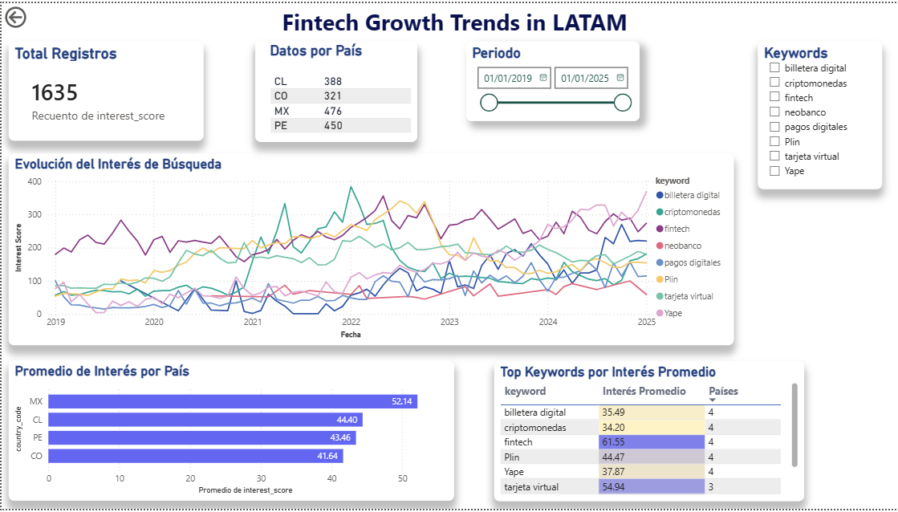
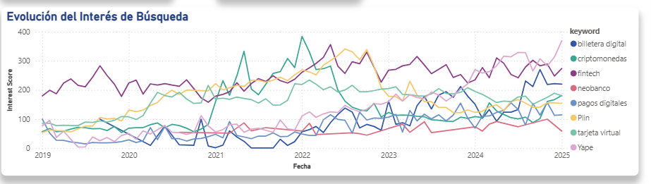

# 🚀 Fintech Growth Trends in LATAM

<div align="center">



**Análisis end-to-end de tendencias fintech en Latinoamérica usando Google Trends, Python, PostgreSQL y Power BI**

[](https://www.python.org/downloads/)
[](https://www.postgresql.org/)
[](https://powerbi.microsoft.com/)
[](LICENSE)

[Ver Dashboard](#-dashboard-interactivo) • [Explorar Código](#-estructura-del-proyecto) • [Resultados Clave](#-resultados-clave)

</div>

---

## 📊 Descripción del Proyecto

Este proyecto analiza la **adopción y crecimiento de tendencias Fintech** en 4 países de Latinoamérica (Chile, Colombia, México, Perú) durante el período **2019-2025**.

Utiliza datos de **Google Trends** para identificar patrones de interés en términos clave como:

- 💳 Billetera Digital
- 🏦 Neobanco
- ₿ Criptomonedas
- 📱 Apps: Yape, Plin
- 💰 Pagos Digitales, Tarjeta Virtual

**Objetivo:** Entender la evolución del mercado financiero digital en la región y revelar insights accionables sobre comportamiento de usuarios.

---

## 🎯 Resultados Clave

### Insights Descubiertos

📈 **México lidera en interés promedio** (52.14) vs otros países  
🔍 **"Fintech" y "Criptomonedas"** son los términos más buscados (73.00)  
🇵🇪 **Apps peruanas (Yape, Plin)** tienen reconocimiento en toda LATAM  
📊 **Crecimiento acelerado post-2021** en búsquedas de pagos digitales  
💳 **"Tarjeta Virtual"** presente solo en 3 de 4 países (mercado en desarrollo)

### Métricas del Dataset

```
📊 Total de registros analizados: 1,635
🌎 Países: 4 (Chile, Colombia, México, Perú)
🔑 Keywords únicos: 8
📅 Período de análisis: 2019-2025 (6 años)
📈 Fuente de datos: Google Trends API
```

---

## 🛠️ Stack Tecnológico

### Data Engineering

- **Python 3.11+**: Lenguaje principal
- **Pytrends**: Extracción de datos de Google Trends
- **Pandas**: Manipulación y transformación de datos
- **Supabase (PostgreSQL)**: Base de datos en la nube
- **SQLAlchemy**: ORM para interacción con base de datos

### Analytics & Visualization

- **Jupyter Notebooks**: Análisis exploratorio (EDA)
- **Power BI Desktop**: Dashboard interactivo
- **SQL**: Queries analíticas y vistas materializadas

### DevOps & Tools

- **Git**: Control de versiones
- **VS Code**: IDE principal
- **Python venv**: Entornos virtuales

---

## 📂 Estructura del Proyecto

```
growth-fintech-trends-latam/
├── 📊 dashboards/
│   ├── fintech_growth_latam.pbix          # Dashboard Power BI
│   └── screenshots/                        # Imágenes del dashboard
├── 📁 data/
│   ├── raw/                                # Datos crudos de Google Trends
│   ├── processed/                          # Datos limpios y transformados
│   └── external/                           # Datos adicionales
├── 📓 notebooks/
│   ├── 01_eda.ipynb                        # Análisis exploratorio
│   └── 02_validation.ipynb                 # Validación de datos
├── 🗄️ sql/
│   ├── schema.sql                          # Schema de la base de datos
│   ├── views.sql                           # Vistas SQL
│   └── growth_queries.sql                  # Queries analíticas
├── 🐍 src/
│   ├── extract/                            # Scripts de extracción
│   │   └── google_trends.py
│   ├── transform/                          # Scripts de limpieza
│   │   └── clean_transform.py
│   ├── load/                               # Scripts de carga a DB
│   │   ├── supabase_loader.py
│   │   ├── fill_missing_data.py
│   │   └── download_final_dataset.py
│   └── config/                             # Configuraciones
│       ├── keywords.py
│       └── countries.py
├── 📄 docs/
│   ├── architecture.md                     # Arquitectura del sistema
│   └── insights_report.md                  # Reporte de insights
├── requirements.txt                        # Dependencias Python
├── .gitignore
└── README.md
```

---

## 💻 Instalación y Uso

### Prerrequisitos

- Python 3.11 o superior
- Cuenta de Supabase (gratuita)
- Power BI Desktop (opcional, solo para ver dashboard)

### Setup

1. **Clonar el repositorio**

```bash
git clone https://github.com/giancarlojp-dev/growth-fintech-trends-latam.git
cd growth-fintech-trends-latam
```

2. **Crear entorno virtual**

```bash
python -m venv venv
source venv/bin/activate  # En Windows: venv\Scripts\activate
```

3. **Instalar dependencias**

```bash
pip install -r requirements.txt
```

4. **Configurar variables de entorno**

```bash
# Crear archivo .env en la raíz del proyecto
SUPABASE_URL=tu_supabase_url
SUPABASE_KEY=tu_supabase_key
```

5. **Ejecutar pipeline ETL** (opcional - ya hay datos en `data/processed/`)

```bash
python -m src.main_pipeline
```

6. **Explorar notebooks**

```bash
jupyter notebook notebooks/01_eda.ipynb
```

---

## 📊 Dashboard Interactivo

### Preview




### Features del Dashboard

✅ **KPI Cards**: Total registros, distribución por país, período de análisis  
✅ **Line Chart**: Evolución temporal del interés por keyword  
✅ **Bar Chart**: Comparación de interés promedio entre países  
✅ **Tabla Dinámica**: Top keywords con métricas clave  
✅ **Filtros Interactivos**: Por fecha y keywords (multi-selección)

### Cómo Abrir el Dashboard

**Opción 1: Power BI Desktop** (recomendado)

1. Descargar e instalar [Power BI Desktop](https://powerbi.microsoft.com/desktop/) (gratis)
2. Abrir `dashboards/fintech_growth_latam.pbix`

**Opción 2: Visualizar Screenshots**

- Ver imágenes en `dashboards/screenshots/`

---

## 🔬 Metodología

### Pipeline ETL

```
┌─────────────┐      ┌──────────────┐      ┌─────────────┐
│  Google     │ ───> │   Python     │ ───> │  Supabase   │
│  Trends API │      │   (Pytrends) │      │ (PostgreSQL)│
└─────────────┘      └──────────────┘      └─────────────┘
                            │
                            ▼
                    ┌──────────────┐
                    │  Pandas      │
                    │  Transform   │
                    └──────────────┘
                            │
                            ▼
                    ┌──────────────┐      ┌─────────────┐
                    │  CSV Final   │ ───> │  Power BI   │
                    │  (Validated) │      │  Dashboard  │
                    └──────────────┘      └─────────────┘
```

### Proceso

1. **Extracción**: Pytrends API con manejo de rate limits (Error 429)
2. **Transformación**: Limpieza, normalización, validación
3. **Carga**: Upsert a Supabase con constraint de duplicados
4. **Validación**: Notebook comparando CSV vs DB
5. **Visualización**: Dashboard interactivo en Power BI

---

## 💡 Desafíos Técnicos Superados

### 1. Extracción Incremental

**Problema**: Google Trends bloquea después de ~10 requests (Error 429)

**Solución**:

- Sistema de extracción incremental con verificación de existencia
- Script `fill_missing_data.py` que detecta gaps automáticamente
- Backoff exponencial con reintentos

### 2. Integridad de Datos

**Problema**: Riesgo de duplicados al reejecutar el pipeline

**Solución**:

- Constraint `UNIQUE(date, country_code, keyword)` en PostgreSQL
- Función `upsert()` con `on_conflict` específico
- Validación en notebook comparando CSV local vs Supabase

### 3. Datos Faltantes por País

**Problema**: Algunos keywords no tienen datos en ciertos países (normal en Google Trends)

**Solución**:

- Aceptar este comportamiento como realidad del negocio
- Documentar keywords disponibles por país
- No forzar datos sintéticos

### 4. Portabilidad del Dashboard

**Problema**: Conexión directa a Supabase requiere credenciales

**Solución**:

- Usar CSV como fuente de datos en Power BI
- CSV descargado de Supabase (`google_trends_final.csv`)
- Permite compartir .pbix sin exponer credenciales

---

## 📚 Aprendizajes Clave

### Data Engineering

- Implementación de pipeline ETL robusto con manejo de errores
- Uso de upsert para idempotencia en cargas de datos
- Validación de datos entre múltiples fuentes (CSV, DB)

### Analytics

- Google Trends como proxy de interés del mercado
- Diferencias regionales en adopción fintech
- Identificación de tendencias temporales (COVID impact)

### Visualization

- Principios UI/UX: F-pattern layout, bordes redondeados, sombras
- Elección de visualizaciones adecuadas (Line vs Bar vs Table)
- Importancia de filtros interactivos para exploración

---

## 👨‍💻 Autor

**Giancarlo Jacobo**

- 🔗 LinkedIn: [giancarlo-jacobo-pachas](https://www.linkedin.com/in/giancarlo-jacobo-pachas-2b687a2b2/)
- 🐙 GitHub: [@giancarlojp-dev](https://github.com/giancarlojp-dev)
- 📧 Email: gianjacobo@gmail.com

---

---

<div align="center">

**⭐ Si este proyecto te resultó útil, considera darle una estrella ⭐**

</div>
